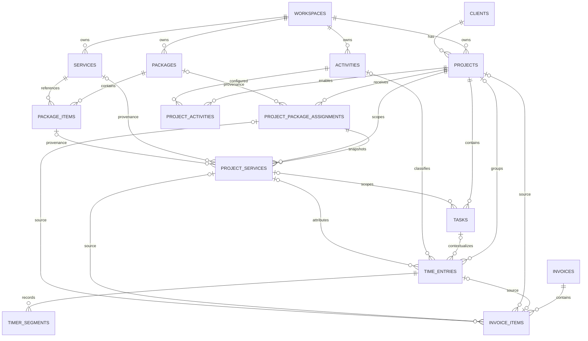

# ADR-001 — Project, Service, Package, Activity, Time, dan Invoice Source Model

- Status: Accepted for Phase 1+
- Decision date: 2026-07-27
- Scope: schema target, lifecycle, naming, compatibility, dan Package policy
- Does not authorize: production migration, destructive cleanup, atau Phase 1 cutover sebelum seluruh Phase 0B gate lulus

## Context

Model lama memakai tabel `packages` untuk dua makna yang bercampur: Package komersial dan katalog yang diberi label Service. `projects.selected_package_id` hanya menyimpan satu referensi katalog. `time_entries` sudah mereferensikan Task, tetapi belum punya Activity reusable, Project Service snapshot, chronology segment, rate/currency snapshot, atau lifecycle approval lengkap. `invoice_items.source_type/source_id` masih bersifat polymorphic.

Phase berikutnya harus menambah model baru tanpa mengubah fakta historis, UUID, jumlah row, harga, currency, usage, tanggal, atau total waktu lama.

## Decisions

1. `Service`, `Package`, `Project`, `Task`, `Activity`, dan `Time Entry` tetap entitas berbeda.
2. Semua tabel tenant target membawa `workspace_id`; relasi lintas entitas divalidasi satu workspace di DB dan application boundary.
3. `project_services` dan `project_package_assignments` adalah snapshot kontrak historis. Perubahan katalog tidak mengubah Project lama.
4. Project Package tidak langsung bergantung pada katalog untuk histori. `source_package_id` nullable hanya provenance.
5. Harga, rate, amount, allowance, dan currency yang memengaruhi histori wajib di-snapshot.
6. Invoice source memakai FK eksplisit. `source_type/source_id` lama dipertahankan sementara untuk dual-read/dual-write.
7. Pause/resume target memakai `timer_segments`; `time_entries.start_time/end_time/paused_at/manual_minutes` lama tetap dibaca selama compatibility window.
8. Package MVP baru adalah allowance one-off sepanjang engagement. Recurring/reset period belum didukung.
9. Legacy copy `/month` diklasifikasikan `legacy_recurring_unmodeled`, read-only, dan tidak diubah otomatis menjadi one-off.
10. Route canonical target: `/app/services` untuk Service dan `/app/packages` untuk Package. Route lama tidak dialihkan sebelum semua caller dan compatibility tests lulus.
11. DB/API identifiers memakai English; UI mengikuti locale ID/EN.
12. Drop/rename kolom atau tabel legacy hanya boleh lewat migration terpisah setelah reconciliation production, rollback window, dan persetujuan eksplisit.

## Target ERD

## Target tables and required fields

### Catalog

`services`

- `id`, `workspace_id`
- `name`, `normalized_name`, `description`, `category_id`
- `default_pricing_model`, `default_unit`, `default_price`, `currency`
- `status: active | archived`
- timestamps
- unique active normalized name per workspace

`service_categories`

- `id`, `workspace_id`, `name`, `normalized_name`, `color`, `sort_order`

`packages`

- existing UUID stays stable
- `workspace_id`, `name`, `description`, `default_price`, `currency`
- MVP `allowance_type = hours`
- `allowance_value`
- `lifecycle_class: one_off | legacy_recurring_unmodeled`
- `status: active | archived`
- no cadence, period reset, carry-over, or automatic renewal in MVP

`package_items`

- `id`, `workspace_id`, `package_id`, `service_id`
- `quantity`, `unit`, `unit_price`, `currency`
- `included_allowance`, `sort_order`

### Project contract snapshots

`project_package_assignments`

- `id`, `workspace_id`, `project_id`
- `source_package_id nullable`
- `source_lifecycle_class`
- `name_snapshot`, `description_snapshot`
- `price_snapshot`, `currency_snapshot`
- `allowance_type_snapshot`, `allowance_value_snapshot`
- `assigned_at`, `status: active | archived`

`project_services`

- `id`, `workspace_id`, `project_id`
- `service_id nullable`, `package_item_id nullable`
- `source_package_assignment_id nullable`
- `name_snapshot`, `description_snapshot`
- `pricing_model_snapshot`, `quantity`, `unit`
- `unit_price`, `currency_snapshot`, `amount`
- `included_allowance`, `sort_order`, `status`

Catalog FK pada snapshot memakai `SET NULL` atau `RESTRICT`. Menghapus katalog tidak boleh menghapus snapshot Project.

### Activity and time

`activities`

- `id`, `workspace_id`, `name`, `normalized_name`
- `default_billable`, `default_hourly_rate`, `default_currency`
- `status: active | archived`

`project_activities`

- `id`, `workspace_id`, `project_id`, `activity_id`
- `enabled`, `rate_override`, `currency_override`, `billable_override`
- unique `(project_id, activity_id)`

`tasks`

- existing fields retained
- add `project_service_id nullable`

`time_entries`

- existing fields retained during compatibility window
- add `entry_type: timer | duration | interval`
- add `activity_id nullable`, `project_service_id nullable`
- description stays independent from Task title
- add `billing_rate_snapshot`, `billing_currency_snapshot`
- optional future `cost_rate_snapshot`, `cost_currency_snapshot`
- add `work_date`, `duration_seconds`, `original_started_at`
- target status: `draft | submitted | approved | rejected | invoiced`
- add submission, approval, rejection actor/time metadata and rejection reason

`timer_segments`

- `id`, `workspace_id`, `time_entry_id`
- `started_at`, `ended_at nullable`
- one open segment maximum per Time Entry
- one active timer maximum per `(workspace_id, user_id)` remains enforced atomically

### Invoice source

`invoice_items` adds explicit nullable FKs:

- `time_entry_id`
- `project_id`
- `project_service_id`
- `package_assignment_id`
- `previous_time_entry_status`
- `name_snapshot`, `description_snapshot`
- `quantity`, `unit`, `unit_price`, `currency`, `amount`

Rules:

- maximum one source FK is populated per line;
- manual line may have all source FKs null;
- one Time Entry may link to at most one active invoice item;
- source FK and invoice must resolve to same workspace/client/project as applicable;
- invoice line snapshots remain stable when source changes later;
- legacy `source_type/source_id` remains dual-written until all readers move;
- sent/viewed/paid invoice lines are immutable except explicit reversal workflow.

## Database invariants

1. Tenant tables use composite uniqueness `(id, workspace_id)` where needed for composite FKs.
2. Project child rows reference `(project_id, workspace_id)`.
3. Service, Package, Activity, Client, Task, Time Entry, dan invoice source cannot cross workspaces.
4. Amount, price, rate, quantity, duration, and allowance values cannot be negative.
5. Currency uses uppercase ISO 4217 code; snapshots cannot be null when related amount/rate exists.
6. Active catalog names use normalized comparison within workspace.
7. Historical rows use `RESTRICT` or `SET NULL`, never cascade from catalog deletion.
8. Archive replaces destructive delete after a row has historical references.
9. `timer_segments.ended_at >= started_at` and at most one segment with `ended_at IS NULL` per entry.
10. `time_entries.entry_type` determines required chronology fields; compatibility readers may fall back to legacy fields.

## Approval and permission transition matrix

Roles currently available: `owner`, `member`, `viewer`. “Own” means `time_entries.user_id` equals authenticated user. Period lock and invoice link override role permission and deny mutation unless explicitly stated.

| From | To | Owner | Member | Viewer | Conditions |
|---|---|---:|---:|---:|---|
| create | draft | any workspace entry | own entry | no | valid same-workspace context |
| draft | draft | edit any | edit own | no | unlocked, not invoice-linked |
| draft | submitted | any | own | no | completed duration; required Activity/context valid |
| draft | deleted | any | own | no | unlocked, not invoice-linked |
| submitted | approved | yes | no | no | owner cannot approve cross-workspace data |
| submitted | rejected | yes | no | no | rejection reason required |
| rejected | draft | yes | own | no | unlocked; rejection audit retained |
| approved | submitted | yes | no | no | correction only, unlocked, not invoice-linked |
| approved | invoiced | system via invoice transaction | no | no | approved + billable + completed + duration > 0 + same client/project/workspace |
| invoiced | approved | system via removal from draft invoice | no | no | restore `previous_time_entry_status`; invoice must still be draft |
| invoiced | any edit/delete | no | no | no | immutable |

Additional rules:

- Member cannot approve/reject own or another member entry.
- Viewer is read-only.
- A locked period blocks edit, delete, submit recall, approval reversal, and rejection rework.
- Each transition writes actor, timestamp, from/to status, reason, and source action to audit history.
- Concurrent invoice imports rely on DB uniqueness and transaction boundaries, not UI state.

## Migration compatibility matrix

| Surface | Legacy read | Legacy write | Target read/write | Cutover rule |
|---|---|---|---|---|
| Project Package | `projects.selected_package_id` | current Project form | `project_package_assignments` | dual-read and dual-write; UUID and resolved values must match before legacy write stops |
| Package catalog | `packages` | `/app/packages` actions | normalized `packages` + `package_items` | retain existing UUID; archive only |
| Service catalog | label “Service” may point at legacy Package data | legacy Package actions | `services` at `/app/services` | no automatic Package-to-Service copy; ambiguous rows enter reconciliation queue |
| Package Project scope | `packages.project_id` legacy rows | legacy actions | assignment + snapshot rows | legacy project package remains readable until every caller migrates |
| Package orders | `package_orders.package_id` + snapshots | portal order action | source Package/assignment plus immutable snapshots | order count/status/price/currency must remain identical |
| Time description | may equal Task title | current task timer copies title | independent description | old rows are not rewritten; new rows stop auto-copy in Phase 1 |
| Time chronology | `start_time/end_time/paused_at/manual_minutes` | current timer | `entry_type`, `work_date`, `duration_seconds`, `timer_segments` | dual-read; total duration/date must match before legacy fields stop writing |
| Time rate | `hourly_rate` | current actions | billing rate/currency snapshots | dual-write until reports/invoices use snapshot fields |
| Time status | `draft/approved/invoiced` | current actions | `draft/submitted/approved/rejected/invoiced` | map legacy approved/invoiced directly; no fabricated submission history |
| Invoice source | `source_type/source_id` | invoice actions | explicit source FKs + snapshots | dual-write; source resolution and totals must match twice before legacy read removal |
| Routes | `/app/packages` | current links | `/app/services` and `/app/packages` | no redirect until all navigation, form, portal, report, invoice, export, and product-update callers pass compatibility tests |
| API/action keys | `selectedPackageId` | current callers | `packageAssignmentId`, `serviceIds` | accept legacy key during compatibility window; reject conflicting legacy/new IDs |

## Naming and route contract

| Concept | DB/API English | TypeScript | UI ID | UI EN | Canonical route |
|---|---|---|---|---|---|
| Project | `project`, `project_id` | `projectId` | Proyek | Project | `/app/projects` |
| Service | `service`, `service_id` | `serviceId` | Layanan | Service | `/app/services` |
| Package | `package`, `package_id` | `packageId` | Paket | Package | `/app/packages` |
| Package assignment | `project_package_assignment` | `packageAssignmentId` | Paket Proyek | Project Package | Project detail |
| Task | `task`, `task_id` | `taskId` | Tugas | Task | Project detail |
| Activity | `activity`, `activity_id` | `activityId` | Aktivitas | Activity | `/app/time` settings/selector |
| Time Entry | `time_entry`, `time_entry_id` | `timeEntryId` | Catatan waktu | Time entry | `/app/time` |

Route policy:

1. `/app/packages` is never redirected to `/app/services`; Package and Service are different concepts.
2. During migration, existing `/app/packages` behavior is treated as legacy Package behavior even if old UI copy says Service.
3. `/app/services` becomes canonical only after `services` schema/actions exist.
4. Caller migration order: navigation, Project form, Project detail, portal/order, invoice, report/export, product updates, tests.
5. Temporary aliases must preserve query/path params and may be removed only after access-log and test evidence show no legacy caller.
6. DB columns stay snake_case; server action/API payload uses camelCase; persisted enum values stay English lowercase.

## Package one-off policy

### New Package

- allowance applies once for the lifetime of one Project assignment;
- MVP supports `hours` allowance only;
- usage is cumulative from assignment start; no automatic monthly reset;
- no cadence, renewal date, carry-over, proration, or `/month` marketing copy;
- editing catalog Package does not modify existing assignments;
- assigning Package snapshots price, currency, allowance, name, description, and included Service lines;
- archive blocks new assignments but preserves all existing assignment/order/invoice history.

### Legacy recurring-looking Package

A row is `legacy_recurring_unmodeled` when name, description, feature copy, or existing semantics promise `/month`, monthly hours, reset, renewal, or equivalent recurring behavior.

Rules:

- preserve UUID, references, row count, hours, price, currency, order history, and measured usage;
- expose read-only warning in admin;
- do not assign it through new one-off flow;
- owner must choose a future explicit migration per Project;
- no conversion until recurring model defines instance period, cadence, start/end, reset, carry-over, proration, and invoice semantics.

## Rejected alternatives

- Rename legacy `packages` to `services` in place: rejected because historical Package meaning and callers would change silently.
- Keep direct `projects.selected_package_id` as final contract: rejected because it lacks assignment history and snapshots.
- Keep only polymorphic invoice `source_type/source_id`: rejected because DB cannot enforce source integrity.
- Rewrite description equal to Task title: rejected because historical data must remain unchanged.
- Continue shifting `start_time` on resume: rejected because original chronology becomes unauditable.
- Treat `/month` as harmless display copy: rejected because it creates unsupported recurring expectations.

## Consequences

- Additive migrations and compatibility code are larger, but rollback remains possible.
- More snapshot columns are intentional duplication for financial/history integrity.
- Cross-workspace constraints may require composite unique keys/FKs or equivalent transaction-safe triggers.
- Full recurring Package model is deferred.
- Phase 1 may start only after ADR, reconciliation, backup/restore, migration replay/idempotency, behavioral integration, dev deploy, and live authenticated smoke gates pass.

## Verification required before Phase 1

- normalized dev/prod baseline evidence;
- ledger checksums aligned with actual objects;
- fresh DB and existing snapshot migrations each pass twice;
- orphan/ID mapping and historical aggregate reconciliation pass;
- backup checksum and disposable restore pass;
- rollback rehearsal restores exact baseline;
- behavioral containment integration passes;
- authenticated live dev smoke passes `/app/dashboard`, `/app/time`, and `/app/projects`.
